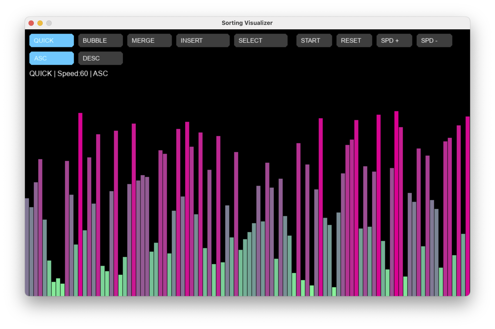

# Sorting Algorithm Visualizer

An interactive visualization tool to understand how different sorting algorithms work.

## 📌 Project Overview

This project helps beginners understand how sorting algorithms work by
visualizing each step of the sorting process in real time.

Instead of only seeing the final sorted array, users can observe how
different algorithms compare and rearrange elements.

---

## 🚀 Features
- Multiple algorithms (Quick, Merge, Bubble, Insertion, Selection)
- Adjustable speed controls
- Ascending & descending sorting
- Interactive UI with buttons
- Real-time visualization

---

## 🛠️ Tech Stack
- Python
- Pygame

---

## ▶️ How to Run

pip install pygame  
python Visualizer.py

---

## 📸 Screenshot

---

## 📌 Author
Abhinav Sehgal
